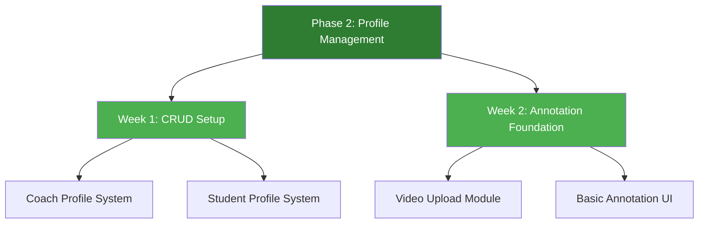
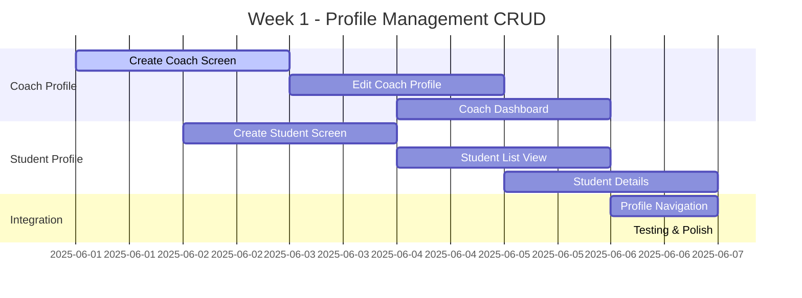
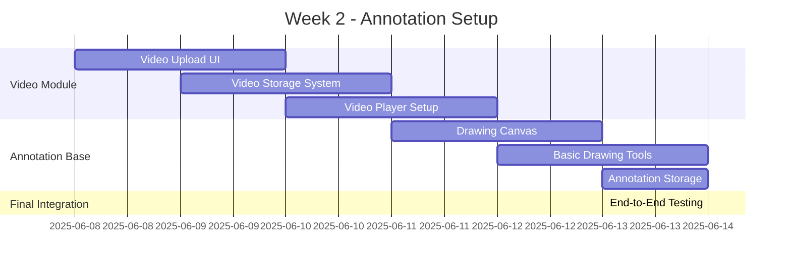
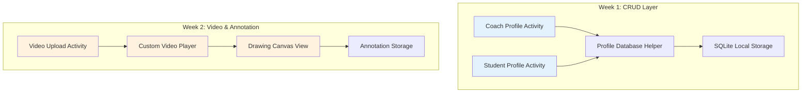
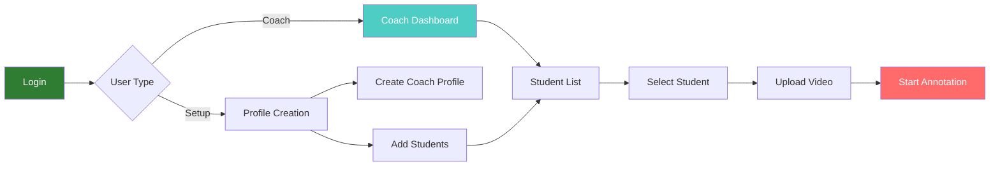
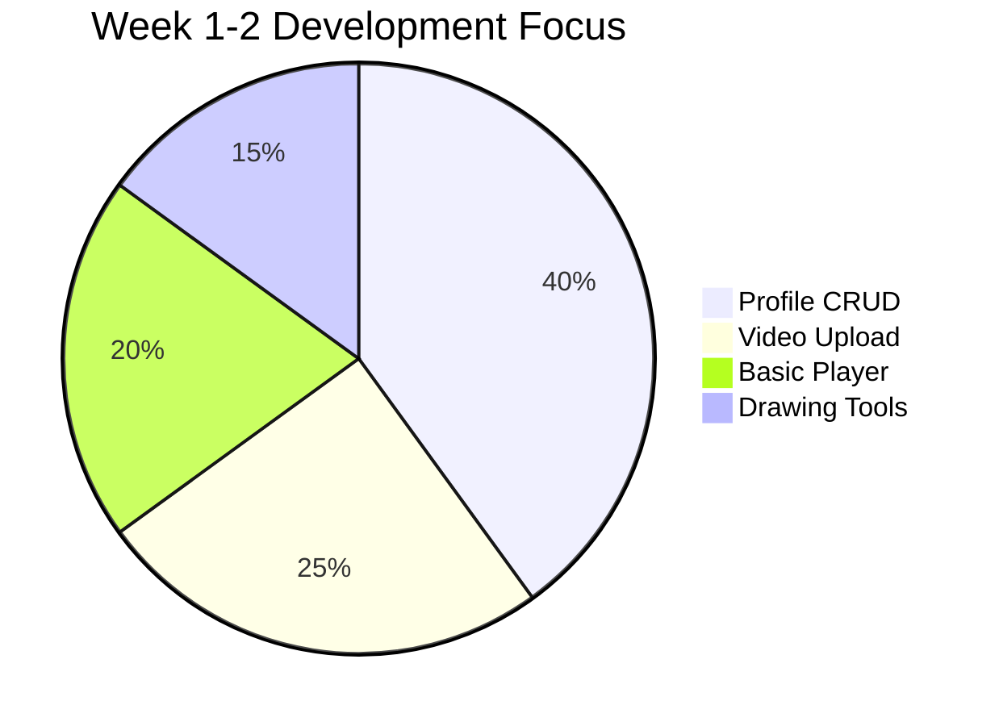

# 🏏 Cricket Coaching App - Next Phase Sprint Plan
## 📅 2-Week Development Cycle

---

## 🎯 Phase 2 Overview: Profile Management System



---

## 📋 Sprint Breakdown

### 🏃‍♂️ **Week 1: CRUD Foundation (Days 1-7)**



### 🎬 **Week 2: Annotation Foundation (Days 8-14)**



---

## 🏗️ Technical Architecture



---

## 📱 User Flow Design



---

## ✅ Week 1 Deliverables

### 👨‍🏫 **Coach Profile System**
- [ ] **Create Coach Profile Screen**
  - Name, Email, Phone, Experience
  - Profile Picture Upload
  - Coaching Credentials
- [ ] **Edit Coach Profile**
  - Update personal information
  - Change profile picture
  - Save/Cancel functionality
- [ ] **Coach Dashboard**
  - Welcome message with coach name
  - Quick stats overview
  - Navigation to students

### 👨‍🎓 **Student Profile System**
- [ ] **Add Student Screen**
  - Student name, age, position
  - Contact details
  - Skill level assessment
- [ ] **Student List View**
  - Grid/List toggle
  - Search functionality
  - Quick student info cards
- [ ] **Student Details**
  - Full student profile
  - Performance history placeholder
  - Edit student information

---

## 🎬 Week 2 Deliverables

### 📹 **Video Management**
- [ ] **Video Upload Interface**
  - Select from gallery
  - Record new video (basic)
  - Video thumbnail preview
- [ ] **Video Storage System**
  - Local file management
  - Video metadata storage
  - File size optimization
- [ ] **Basic Video Player**
  - Play/Pause controls
  - Seek bar
  - Full-screen mode

### ✏️ **Annotation Foundation**
- [ ] **Drawing Canvas Overlay**
  - Touch drawing functionality
  - Basic pen tool
  - Clear/Undo options
- [ ] **Annotation Storage**
  - Save drawing coordinates
  - Link annotations to video timeline
  - Basic annotation retrieval

---

## 📊 Success Metrics



### 🎯 **Definition of Done**
- ✅ Coach can create and edit profile
- ✅ Coach can add/manage students
- ✅ Coach can upload video for student
- ✅ Coach can draw basic annotations on video
- ✅ All data persists locally
- ✅ Smooth navigation between all screens

---

## 🛠️ Technical Implementation

### 📱 **New Activities to Create**
1. `CoachProfileActivity.java`
2. `StudentProfileActivity.java` 
3. `StudentListActivity.java`
4. `VideoUploadActivity.java`
5. `VideoPlayerActivity.java`

### 🗄️ **Database Schema**
```sql
-- Coach Table
CREATE TABLE coaches (
    id INTEGER PRIMARY KEY,
    name TEXT NOT NULL,
    email TEXT UNIQUE,
    phone TEXT,
    experience_years INTEGER
);

-- Student Table  
CREATE TABLE students (
    id INTEGER PRIMARY KEY,
    coach_id INTEGER,
    name TEXT NOT NULL,
    age INTEGER,
    position TEXT,
    skill_level TEXT,
    FOREIGN KEY(coach_id) REFERENCES coaches(id)
);

-- Video Table
CREATE TABLE videos (
    id INTEGER PRIMARY KEY,
    student_id INTEGER,
    file_path TEXT NOT NULL,
    created_date TEXT,
    FOREIGN KEY(student_id) REFERENCES students(id)
);
```

---

## 🚀 Sprint Goals

### 🏆 **Primary Objectives**
1. **Complete CRUD functionality** for Coach & Student profiles
2. **Establish video workflow** from upload to basic playback
3. **Implement foundation** for annotation system
4. **Maintain clean UI/UX** consistent with current design

### 🎯 **Success Criteria**
- Coach can manage student roster effectively
- Video upload and playback works smoothly  
- Basic drawing on video is functional
- App remains crash-free and performant

---

## 📋 Daily Standup Structure

### 🌅 **Daily Questions**
1. What did I complete yesterday?
2. What will I work on today?
3. Any blockers or challenges?

### 🎯 **Weekly Review Points**
- **Week 1:** CRUD functionality complete?
- **Week 2:** Annotation foundation ready?

---

```
🏏 Ready to build the next phase! Let's create those profiles and start annotating! ⚡
```

---

*📝 2-Week Sprint Plan - June 1-14, 2025*
