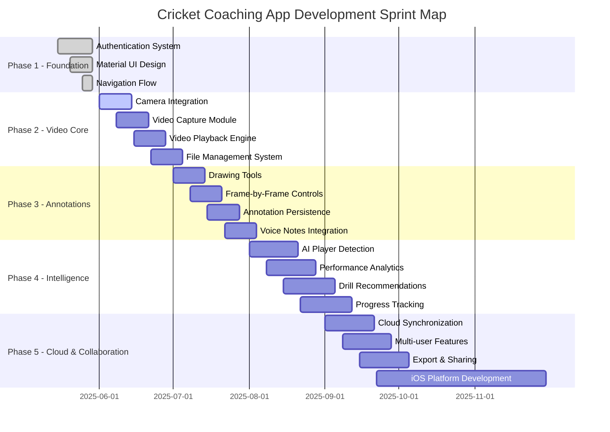
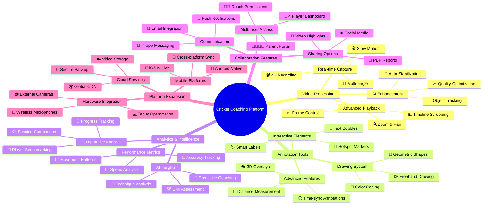
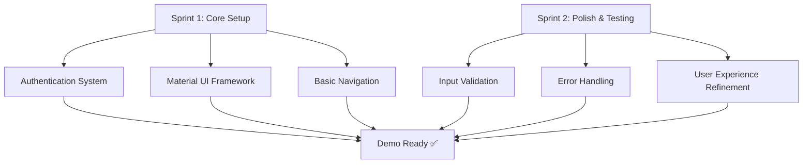
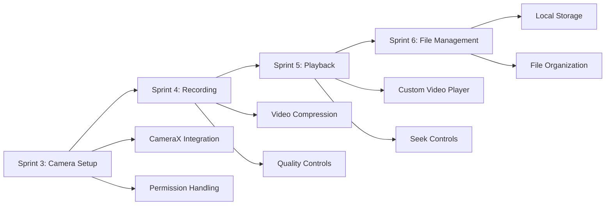
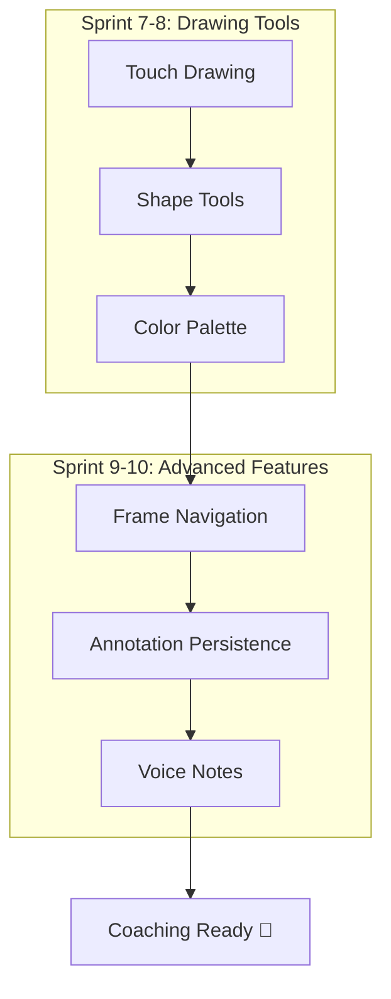
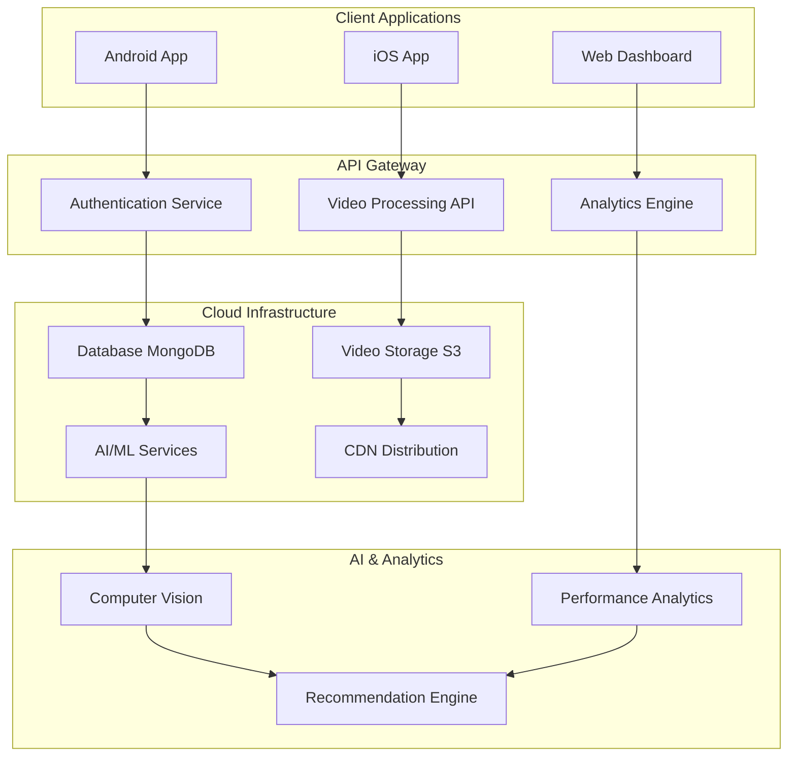
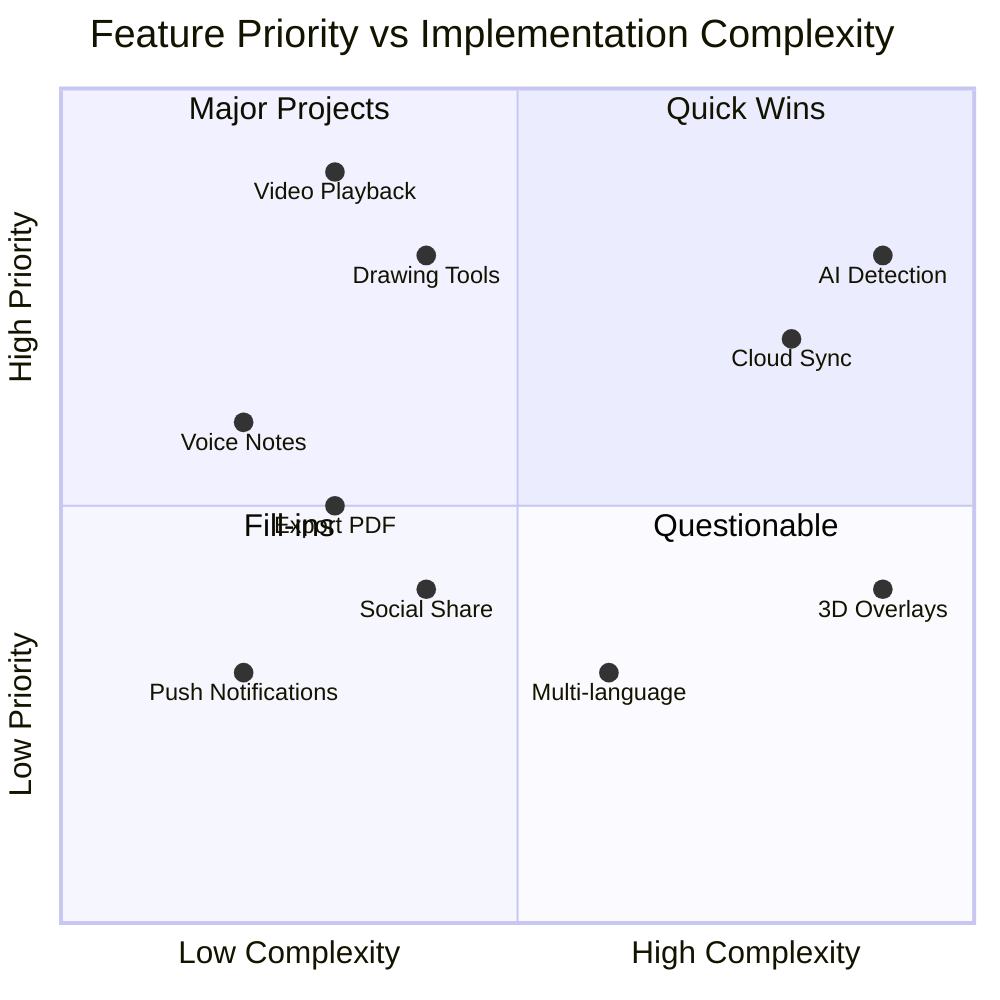
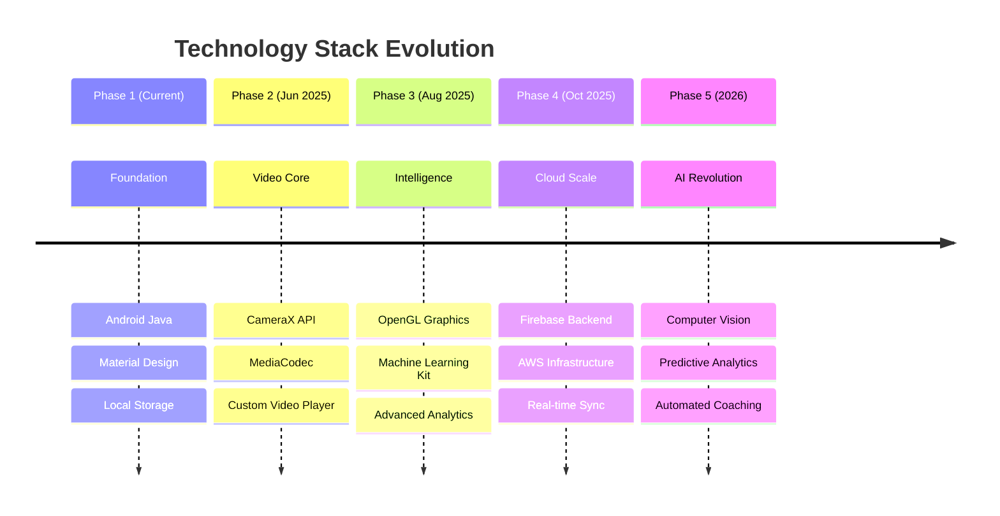
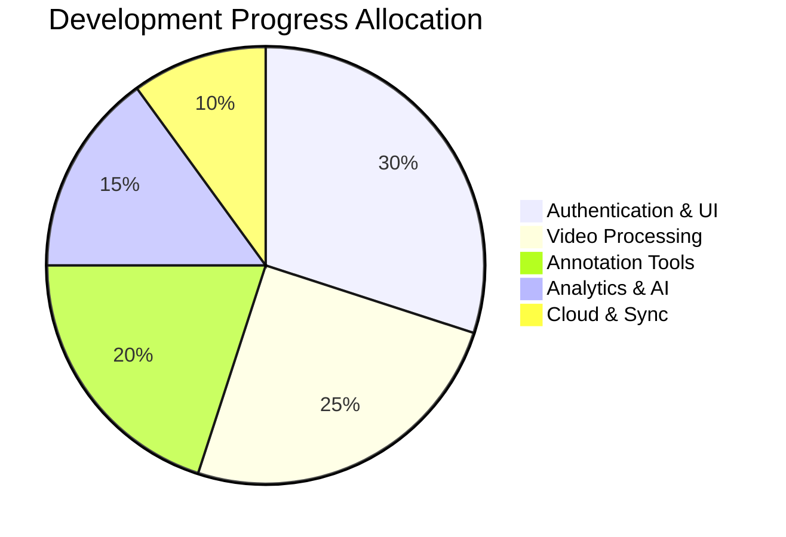
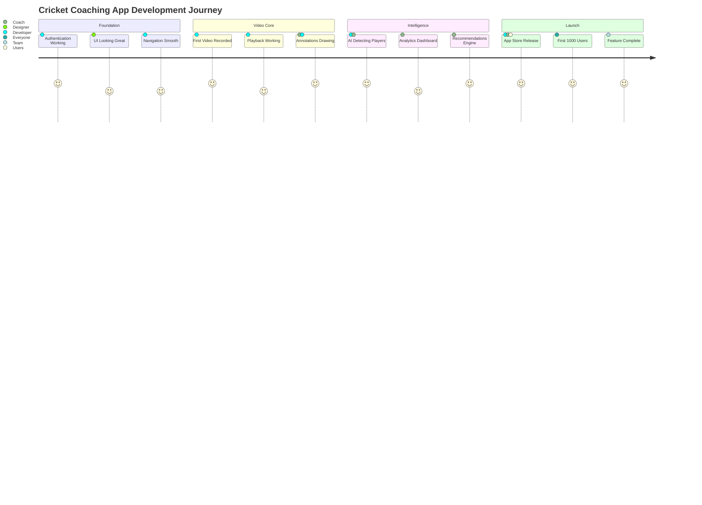

# 🏏 Cricket Coaching App - Sprint Map & Future Vision

## 🗓️ Sprint Roadmap (Development Timeline)

---

## 🧠 Future Vision Mind Map

---

## 📋 Detailed Sprint Breakdown

### 🏃‍♂️ Sprint 1-2: Foundation Phase (Current)

### 🎥 Sprint 3-6: Video Core Phase

### ✏️ Sprint 7-10: Annotation Phase

---

## 🔮 Long-term Vision Architecture

---

## 🎯 Feature Priority Matrix

---

## 🚀 Technology Evolution Path

---

## 📊 Success Metrics Dashboard

---

## 🏁 Milestone Celebrations

---

## 🎯 Next Sprint Planning

### Immediate Priorities (Sprint 3)
- [ ] 📹 CameraX integration
- [ ] 🎬 Basic video recording
- [ ] 📱 Camera permissions handling
- [ ] 🔧 Video quality settings

### Sprint 4 Goals
- [ ] ⏯️ Video playback functionality
- [ ] 🎚️ Playback controls (play/pause/seek)
- [ ] 📐 Video orientation handling
- [ ] 💾 Local video storage

---

*🏏 Ready to build the future of cricket coaching! Let's make every sprint count! ⚡*
