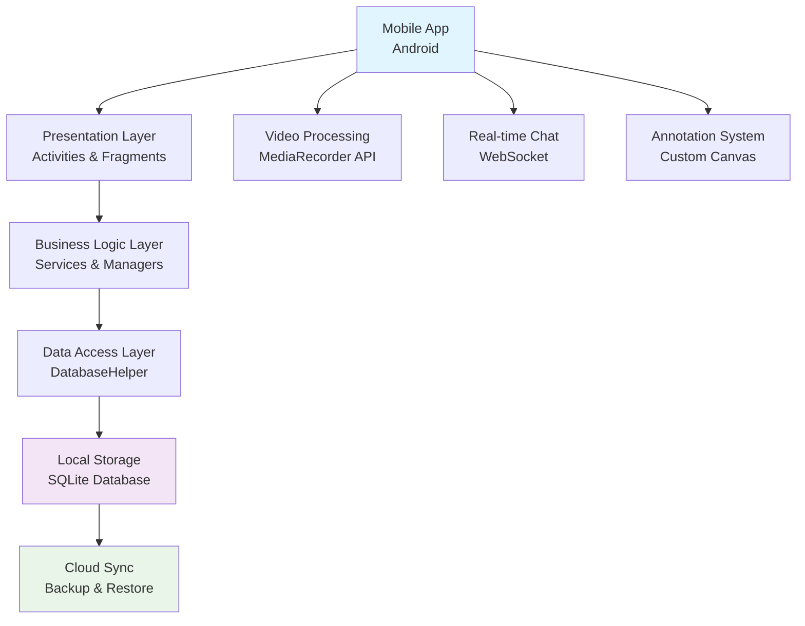
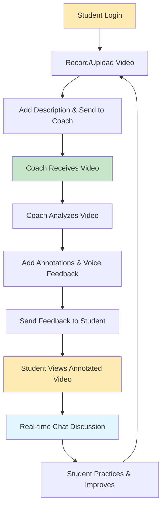
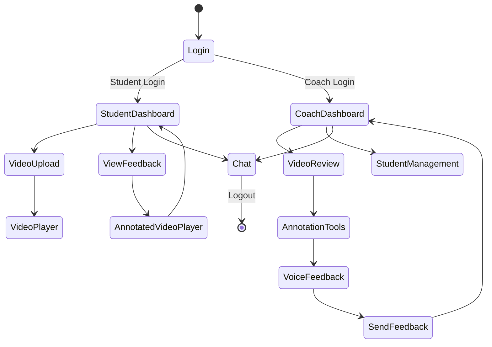
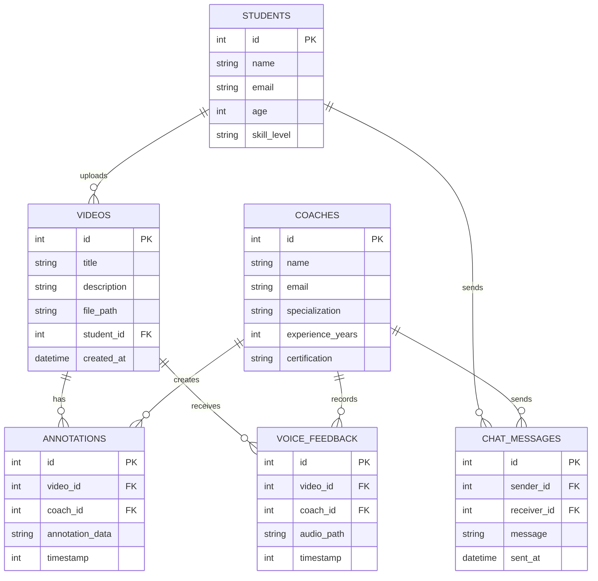
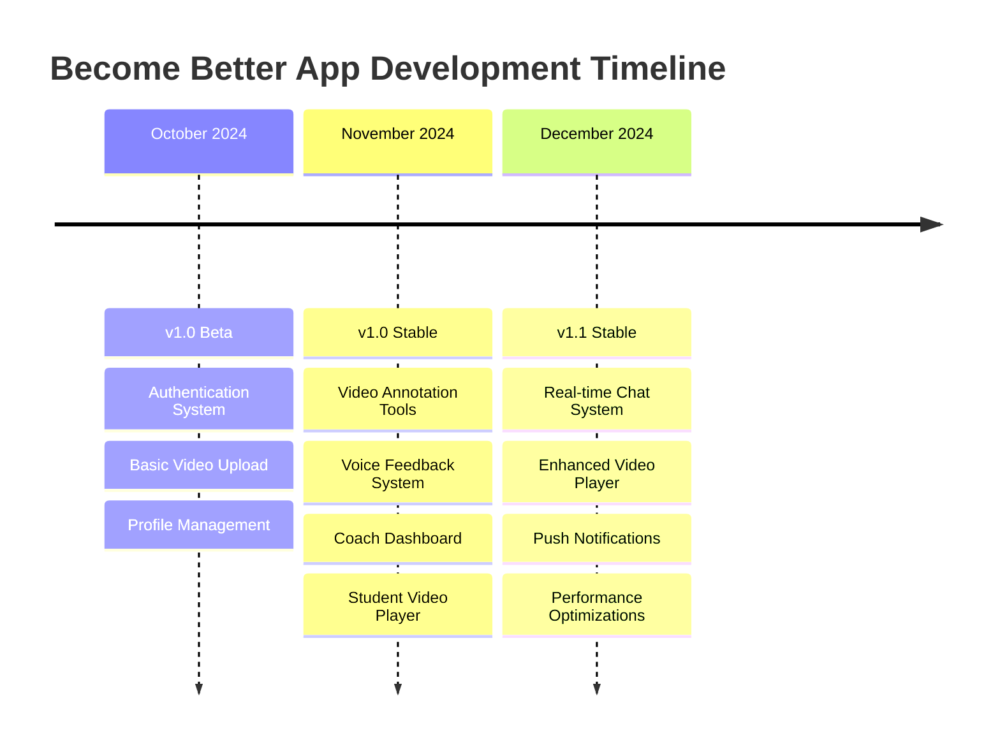
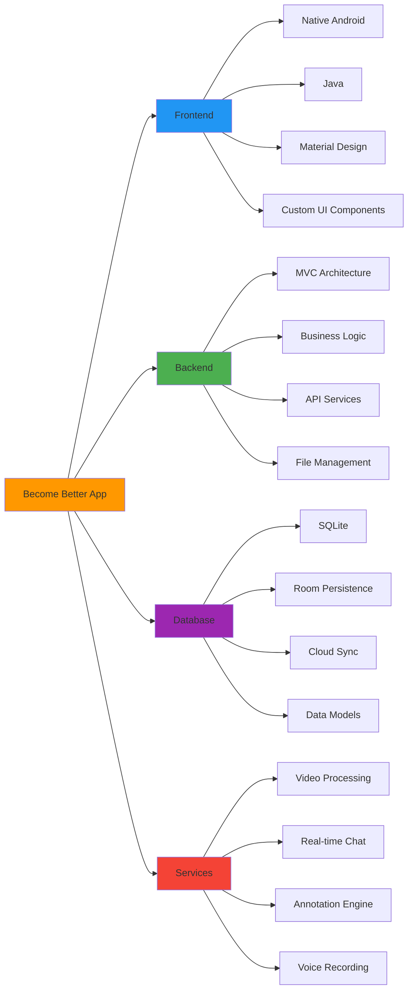
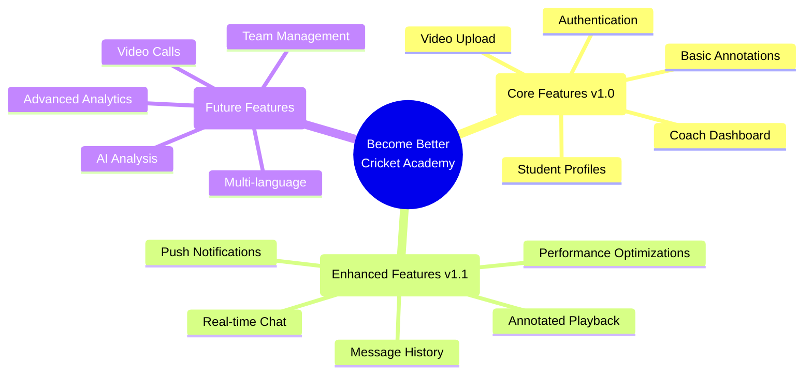
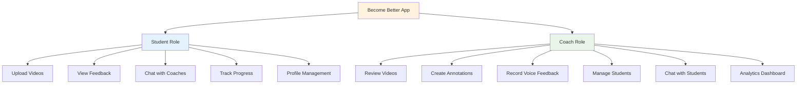
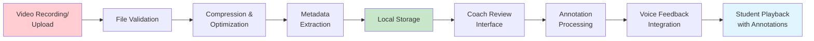
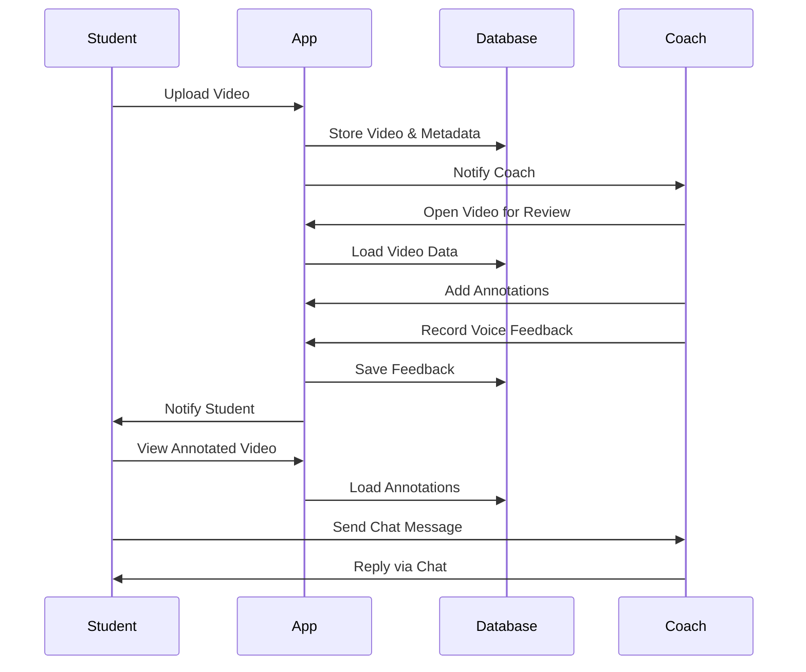

# Mermaid Diagrams for Become Better App Presentation

## 1. System Architecture Diagram

## 2. User Workflow Diagram

## 3. App Navigation Flow

## 4. Database Schema Diagram

## 5. Development Timeline

## 6. Technology Stack Diagram

## 7. Feature Evolution Diagram

## 8. User Roles and Permissions

## 9. Video Processing Pipeline

## 10. Communication Flow

---
